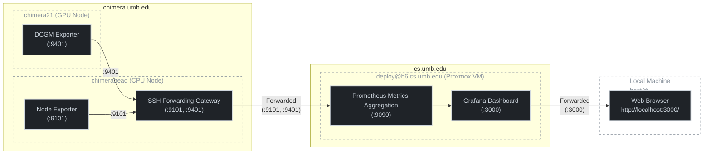

# chimera-dashboard
## Project Website
You can view the live website here:  
[Chimera Performance Metrics Website](https://www.cs.umb.edu/~hdeblois/cs410/longproj02/t6/#documentation)

## Dev Guide
1. Install npm
2. Install npm dependencies
```bash
npm install
```
3. You can automatically have tailwindcss watch your changes with the following command:
```bash
npm run watch-css
```
4. The `index.html` and `styles.css` can be found in `src/` directory.


